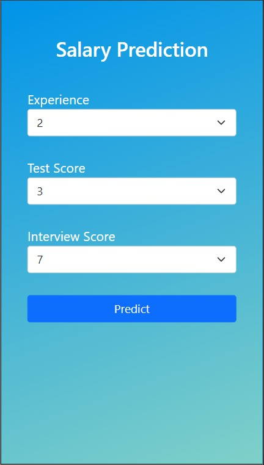

# Salary Prediction using ML

Applied basic Linear Regression on my dataset "hiring.csv".
Data set downloaded from [kaggle](https://www.kaggle.com/pankeshpatel/hiring)

Written a Flask server and created a simple UI using HTML/CSS

And finally deployed the model on Heroku 

https://salary-predictionml.herokuapp.com/

